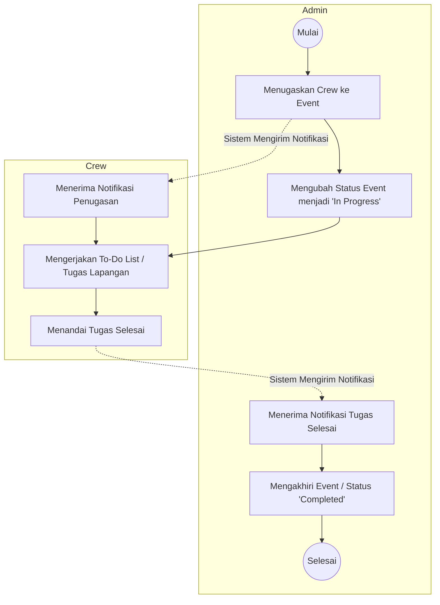

# Activity Diagram Persiapan Acara

Berikut adalah activity diagram sederhana untuk proses persiapan acara yang melibatkan Admin dan Crew:

```mermaid
flowchart TD
    subgraph Admin [Admin]
        Start((Mulai)) --> Assign[Menugaskan Crew ke Event]
        Assign --> StartEvent[Mengubah Status Event menjadi 'In Progress']
        WaitNotif[Menerima Notifikasi Tugas Selesai]
        WaitNotif --> EndEvent[Mengakhiri Event / Status 'Completed']
        EndEvent --> End((Selesai))
    end

    subgraph Crew [Crew]
        ReceiveAssign[Menerima Notifikasi Penugasan]
        DoTask[Mengerjakan To-Do List / Tugas Lapangan]
        UpdateTask[Menandai Tugas Selesai]
    end

    %% Alur dan Komunikasi antar Aktor
    Assign -.->|Sistem Mengirim Notifikasi| ReceiveAssign
    ReceiveAssign --> DoTask
    StartEvent --> DoTask
    DoTask --> UpdateTask
    UpdateTask -.->|Sistem Mengirim Notifikasi| WaitNotif
```
