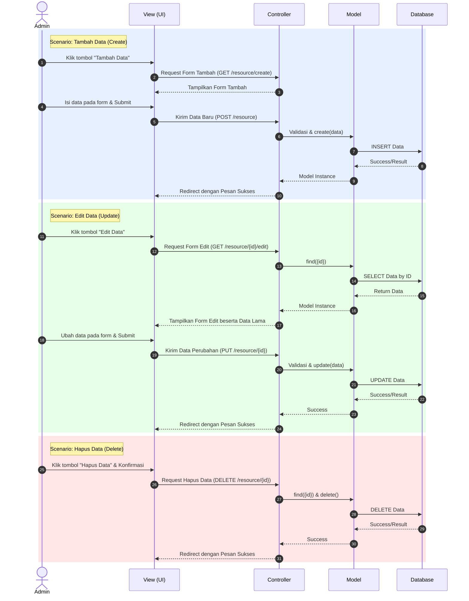

# Sequence Diagram Pengelolaan Data (Admin)

Diagram ini menggambarkan alur proses pengelolaan data (Tambah, Edit, Hapus) untuk entitas seperti Crews, Package, dan Vendor yang dilakukan oleh aktor Admin.

