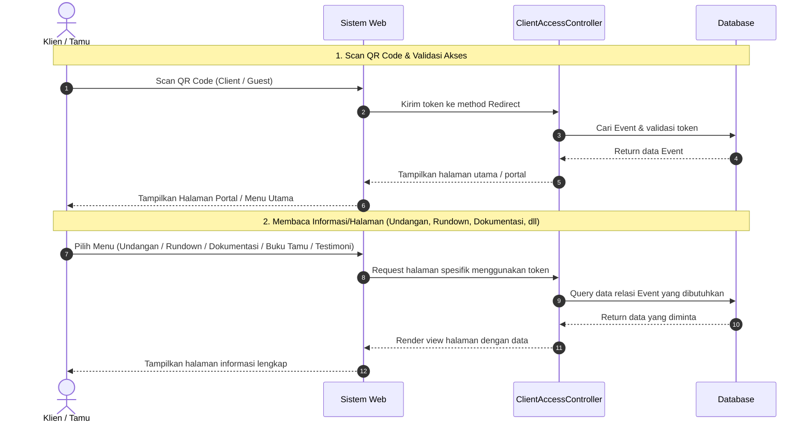

# Sequence Diagram - Client Access (Read Data)

Dokumen ini berisi sequence diagram sederhana untuk alur membaca (*read*) data halaman Client Access setelah melakukan pemindaian QR Code.

---

## Alur Pembacaan Data Klien & Tamu

### Rincian Endpoint Pembacaan Data (Read):

| Aktivitas | Route / URL | Controller Method | Data yang Dibaca |
|-----------|-------------|-------------------|-------------------|
| **Scan QR (Akses Awal)** | `GET /qr/client/{token}` atau `/qr/guest/{token}` | `clientQrRedirect` / `guestQrRedirect` | Status keaktifan QR Event |
| **Buka Undangan** | `GET /invitation/{token}` | `showInvitation` | Detail acara & Nama Pengantin |
| **Lihat Rundown** | `GET /rundown/{token}` | `showRundown` | Agenda/jadwal acara (`rundowns`) |
| **Lihat Dokumentasi** | `GET /documentation/{token}` | `showDocumentation` | Foto & Galeri acara |
| **Lihat Buku Tamu** | `GET /guest-book/{token}` | `showGuestBook` | Daftar hadir tamu (`guestBooks`) |
| **Lihat Testimoni** | `GET /testimonial/{token}` | `showTestimonial` | Penilaian & kesan pesan (`testimonial`) |

