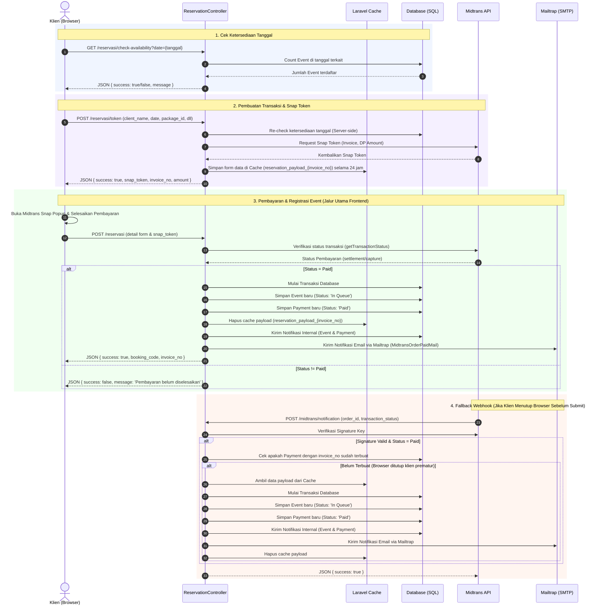
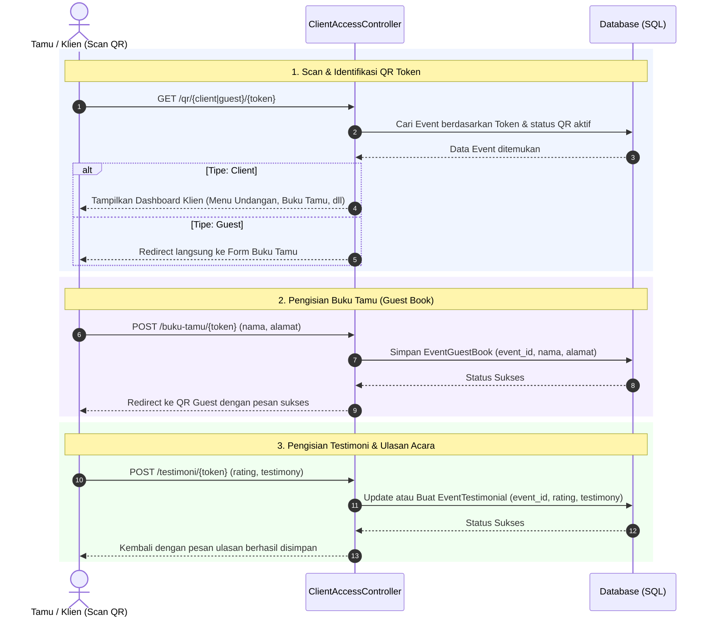
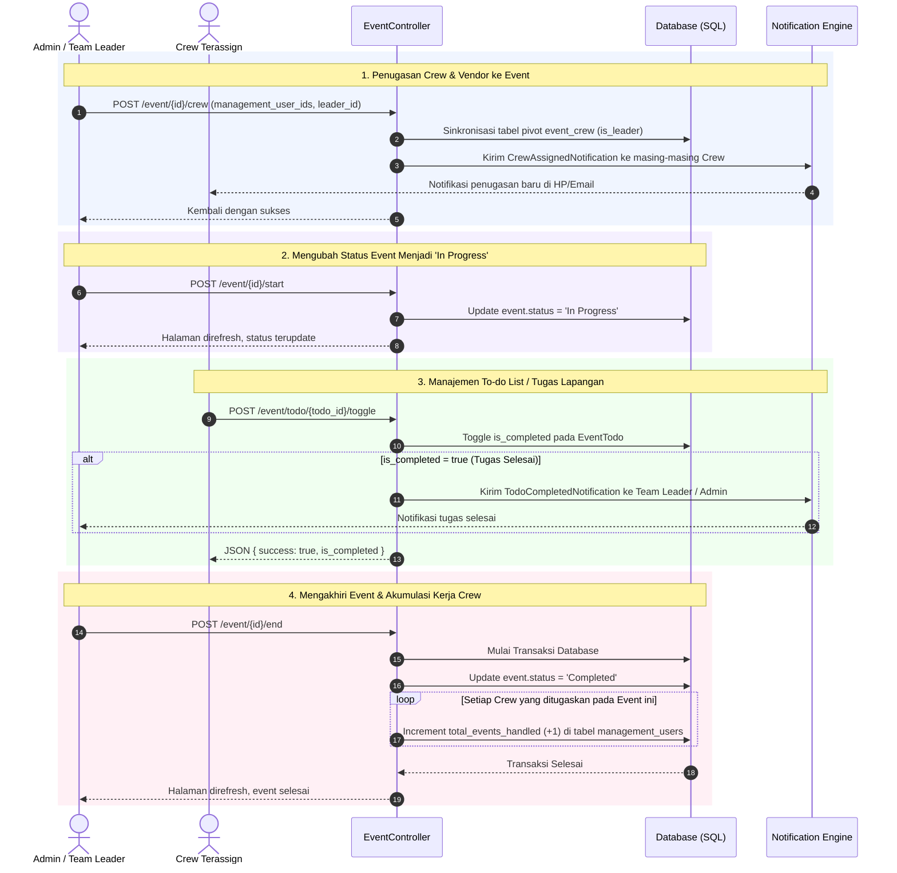

# Sequence Diagram Aktivitas Kunci - Wedding Management System

Dokumen ini berisi sequence diagram untuk tiga alur aktivitas utama yang berjalan pada sistem manajemen pernikahan (*Wedding Management System*).

---

## 1. Alur Reservasi Pernikahan & Pembayaran DP (Integrasi Midtrans)

Alur ini menjelaskan bagaimana klien melakukan reservasi tanggal pernikahan di halaman depan (*landing page*), melakukan pengecekan ketersediaan tanggal, memperoleh Snap Token dari Midtrans, melakukan pembayaran, hingga sistem memvalidasi pembayaran dan mendaftarkan event beserta data pembayarannya. Alur ini juga menyertakan *fallback* jika pengguna menutup browser sebelum halaman memproses status sukses secara manual.

---

## 2. Alur Akses Undangan Online & Buku Tamu (QR Code)

Alur ini menjelaskan interaksi ketika Tamu Undangan atau Klien melakukan pemindaian QR Code unik untuk mengakses *landing page* undangan online, melihat rundown, dokumentasi, mengisi buku tamu, hingga memberikan testimoni (rating dan ulasan).

---

## 3. Alur Pelaksanaan Acara & Manajemen Crew

Alur ini menjelaskan aktivitas dari sisi tim manajemen (Administrator/Team Leader) dalam mengatur kelancaran hari pelaksanaan acara: menugaskan crew & vendor, memulai acara (*In Progress*), menandai tugas (*checklist/todo*), dan mengakhiri acara (*Completed*) yang secara otomatis memicu perhitungan poin kerja crew.

